# Servidor Web con Framework IoC basado en Reflexión

- **Autor**: Carlos David Barrero Velasquez
- **Universidad**: Escuela Colombiana de Ingeniería Julio Garavito
- **Asignatura**: Arquitecturas Empresariales (AREP)
- **Fecha**: Marzo 2026

## Introducción

Este laboratorio implementa un **servidor web tipo Apache** en Java puro, sin frameworks externos, que integra un sistema de **Inversión de Control (IoC)** mediante reflexión para construir aplicaciones web a partir de POJOs anotados. El servidor soporta contenido estático (HTML, PNG) y endpoints dinámicos configurados mediante anotaciones personalizadas.

**Contenido principal**:
- **Servidor HTTP Nativo**: Implementación con `HttpServer` de Java, atendiendo múltiples solicitudes no concurrentes
- **Framework IoC con Reflexión**: Carga automática de componentes mediante escaneo de classpath y anotaciones
- **Anotaciones Personalizadas**: `@RestController`, `@GetMapping`, `@RequestParam` para definir servicios REST
- **Despliegue en AWS EC2**: Configuración de instancia, security groups y ejecución en producción

---

## Estructura del Repositorio

```
web/
│
├── src/
│   ├── main/
│   │   ├── java/com/eci/arep/web/
│   │   │   ├── WebApplication.java          # Bootstrap del framework
│   │   │   ├── ControllerRegistry.java      # Registro y escaneo de controladores
│   │   │   ├── HttpWebServer.java           # Servidor HTTP
│   │   │   ├── RouteHandler.java            # Invocador de métodos por reflexión
│   │   │   ├── Request.java                 # Parseador de query params
│   │   │   ├── GetMapping.java              # Anotación para endpoints GET
│   │   │   ├── RestController.java          # Anotación de componente
│   │   │   ├── RequestParam.java            # Anotación de parámetros
│   │   │   └── HelloController.java         # Controlador de ejemplo
│   │   └── resources/
│   │       └── static/
│   │           ├── index.html               # Página principal
│   │           └── pixel.png                # Imagen de prueba
│   └── test/
│       └── java/com/eci/arep/web/
│           └── WebApplicationTests.java     # Pruebas unitarias
├── pom.xml                                   # Configuración Maven
├── README.md                                 # Este archivo
└── Capturas/                                 # Evidencias de despliegue AWS
    ├── LanzarInstancia.png
    ├── SecurityGroup.png
    ├── ConexionSsh.png
    ├── EjecucionEc2.png
    └── [endpoints...]
```

---

## Cómo Ejecutar

### Requisitos:
- Java 17+
- Maven 3.9+

### Cómo lo corrí en mi máquina (Windows)

Compilé el proyecto:
```bash
.\mvnw.cmd clean package
```

Ejecuté el servidor con escaneo automático:
```bash
java -cp target/classes com.eci.arep.web.WebApplication
```

```bash
java -cp target/classes com.eci.arep.web.WebApplication com.eci.arep.web.HelloController
```

### En Linux/Mac:

```bash
# Compilar
mvn clean package

# Ejecutar con escaneo automático
java -cp target/classes com.eci.arep.web.WebApplication
```

### Probar Endpoints:

```bash
http://localhost:35000/
http://localhost:35000/greeting?name=David
http://localhost:35000/pi
http://localhost:35000/hello
http://localhost:35000/pixel.png
```

---

## Arquitectura del Framework IoC

### Componentes Principales

**1. Sistema de Anotaciones**  
Define el contrato para marcar componentes y endpoints mediante `@RestController`, `@GetMapping` y `@RequestParam`.

**2. ControllerRegistry**  
Escanea el classpath buscando clases anotadas con `@RestController` y registra métodos `@GetMapping`.

**3. RouteHandler**  
Invoca métodos mediante reflexión, resolviendo parámetros `@RequestParam` desde el query string.

**4. HttpWebServer**  
Servidor HTTP que escucha en todas las interfaces (0.0.0.0) y enruta solicitudes a controladores registrados.

### Flujo de Ejecución

```
1. Inicio de aplicación
   └─> WebApplication.main()

2. Bootstrap del framework
   ├─> Parseo de argumentos (--port, clases explícitas)
   └─> ControllerRegistry.scanPackage("com.eci.arep")

3. Escaneo de componentes
   ├─> Buscar clases con @RestController
   ├─> Instanciar controladores
   └─> Registrar métodos @GetMapping en mapa de rutas

4. Inicio del servidor HTTP
   └─> HttpWebServer.start() en puerto 35000

5. Atención de solicitudes
   ├─> GET /greeting?name=David
   ├─> RouteHandler encuentra método anotado
   ├─> Resuelve @RequestParam("name")
   └─> Invoca método por reflexión → "Hola David"
```

---

## Pruebas Automatizadas

Se implementaron pruebas unitarias que validan:
- Registro de rutas con `@GetMapping`
- Resolución de `@RequestParam` con valor por defecto
- Resolución de `@RequestParam` desde query string

Ejecutar pruebas:
```bash
mvn test
```

Resultado:
```
[INFO] Tests run: 3, Failures: 0, Errors: 0, Skipped: 0
[INFO] BUILD SUCCESS
```

---

## Despliegue en AWS EC2

### 1. Creación de Instancia EC2

Se configuró una instancia Amazon Linux 2023 con Java 17 preinstalado:

<p align="center">
  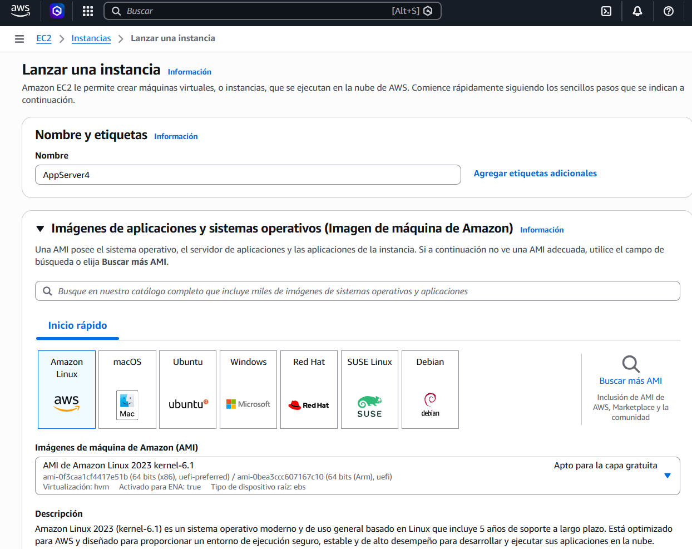
</p>
*Figura 1: Configuración inicial de instancia EC2 - Amazon Linux 2023, t2.micro*

<p align="center">
  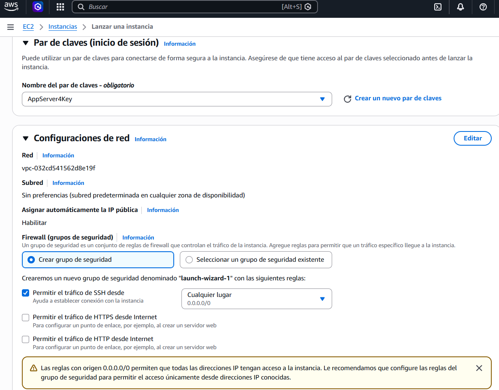
</p>
*Figura 2: Generación de par de claves SSH para acceso seguro*

<p align="center">
  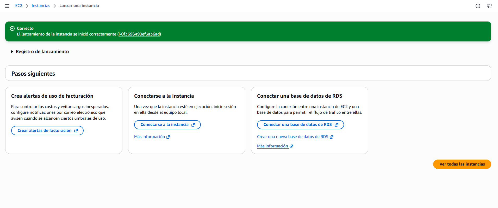
</p>
*Figura 3: Correcta creación*

<p align="center">
  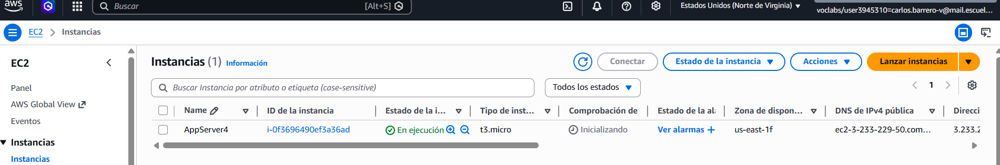
</p>
*Figura 4: Resumen final antes de lanzar la instancia*

### 2. Configuración de Security Group

Puerto 35000 abierto para acceso HTTP desde cualquier origen:

<p align="center">
  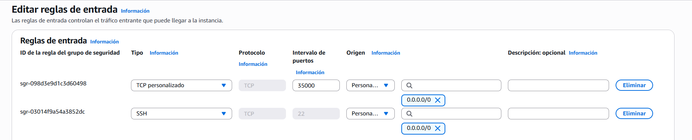
</p>
*Figura 5: Reglas de entrada del Security Group - Puerto 35000 TCP habilitado*

**Reglas configuradas**:
```
Type: Custom TCP
Protocol: TCP
Port Range: 35000
Source: 0.0.0.0/0
```

### 3. Conexión y Transferencia de Archivos

Conexión SSH y transferencia del zip compilado:
<p align="center">
  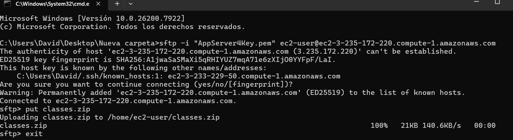
</p>
*Figura 6: Transferencia de archivos compilados via SFTP*

<p align="center">
  
</p>
*Figura 7 : Conexión exitosa via SSH a la instancia EC2*


**Comandos utilizados**:
```bash
# Conexión SSH
ssh -i "AppServer4Key.pem" ec2-user@ec2-3-235-172-220.compute-1.amazonaws.com
# Subida del artefacto por SFTP
sftp -i "AppServer4Key.pem" ec2-user@ec2-3-235-172-220.compute-1.amazonaws.com

# Ejecutar servidor
java -cp classes com.eci.arep.web.WebApplication
```

### 4. Servidor en Ejecución

Servidor corriendo exitosamente en EC2:

<p align="center">
  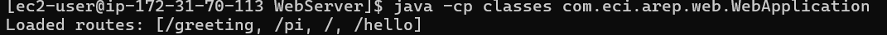
</p>
*Figura 8: Servidor iniciado y escuchando en puerto 35000*

**Output del servidor**:
```
Loaded routes: [/, /pi, /hello, /greeting]
Server running on http://0.0.0.0:35000
```

### 5. Validación de Endpoints

Se validaron todos los endpoints definidos en el controlador:

<p align="center">
  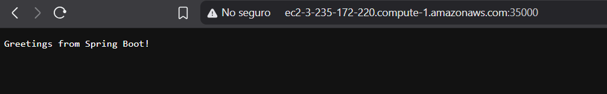
</p>
*Figura 9: Endpoint raíz (/) retornando mensaje de bienvenida*

<p align="center">
  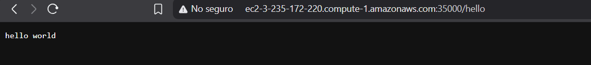
</p>
*Figura 10: Endpoint /hello retornando "hello world"*

<p align="center">
  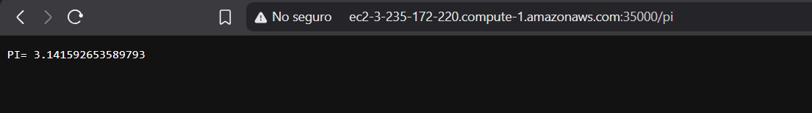
</p>
*Figura 11: Endpoint /pi calculando y retornando valor de PI*

<p align="center">
  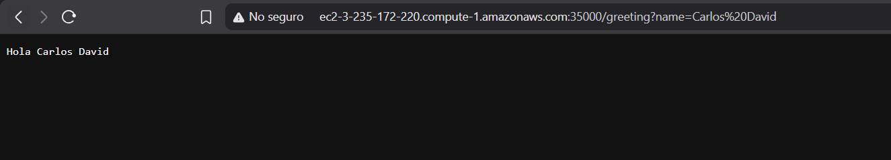
</p>
*Figura 12: Endpoint /greeting con parámetro name funcionando correctamente*

<p align="center">
  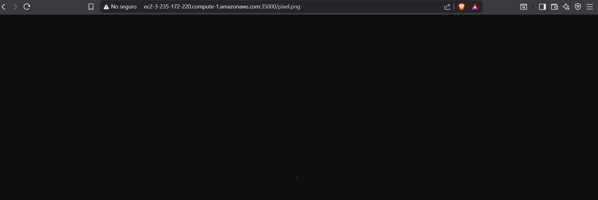
</p>
*Figura 13: Servidor sirviendo correctamente imagen estática pixel.png*

### 6. URL Pública de Despliegue

**URL de producción**:
```
http://ec2-3-235-172-220.compute-1.amazonaws.com:35000/
```

**Endpoints disponibles**:
- `/` - Mensaje de bienvenida
- `/hello` - Hello world
- `/pi` - Cálculo de PI
- `/greeting?name=AWS` - Saludo personalizado
- `/pixel.png` - Imagen estática

---

## Resultados Clave

### Funcionalidades Implementadas

- Servidor HTTP nativo con soporte GET
- Framework IoC con reflexión y escaneo de classpath
- Anotaciones personalizadas (@RestController, @GetMapping, @RequestParam)
- Inyección de parámetros con valores por defecto
- Servicio de estáticos (HTML, PNG)
- Despliegue en AWS EC2 con acceso público
- Pruebas unitarias con cobertura del core del framework  

## Conclusiones

1. **La reflexión de Java** permite construir frameworks IoC completos sin dependencias externas, proporcionando control total sobre la carga de componentes y resolución de dependencias.

2. **El patrón de anotaciones** simplifica la declaración de endpoints y parámetros, haciendo el código más declarativo y mantenible.

3. **HttpServer nativo de Java** es suficiente para aplicaciones web simples, aunque frameworks como Netty ofrecen mejor rendimiento para alta concurrencia.

4. **El escaneo de classpath** mediante reflexión tiene un costo de arranque pero permite descubrimiento automático de componentes sin configuración explícita.

5. **El despliegue en EC2** requiere configuración correcta de Security Groups y binding del servidor a `0.0.0.0` para permitir acceso externo.

---

## Referencias

- Presentación del profesor: [Meta-Reflection-Annotations](https://campusvirtual.escuelaing.edu.co/moodle/pluginfile.php/132081/mod_resource/content/0/03Meta-Reflection-Annotations.pdf)
- Oracle Java Documentation: [Reflection API](https://docs.oracle.com/javase/tutorial/reflect/index.html)
- Oracle Java Documentation: [Annotations](https://docs.oracle.com/javase/tutorial/java/annotations/)
- Oracle Java Documentation: [HTTP Server](https://docs.oracle.com/en/java/javase/17/docs/api/jdk.httpserver/com/sun/net/httpserver/HttpServer.html)
- AWS Documentation: [Amazon EC2 User Guide](https://docs.aws.amazon.com/ec2/)
- Baeldung: [A Guide to Java Reflection](https://www.baeldung.com/java-reflection)
