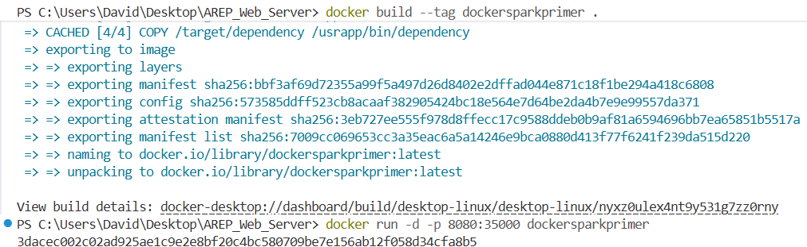
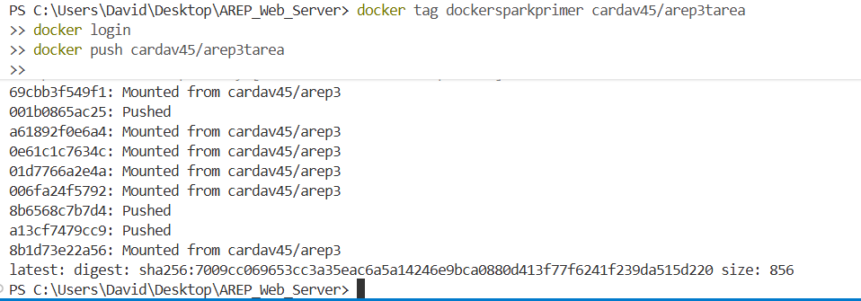
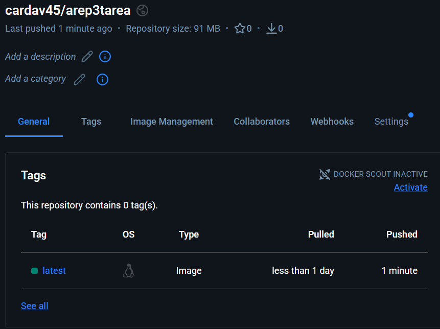
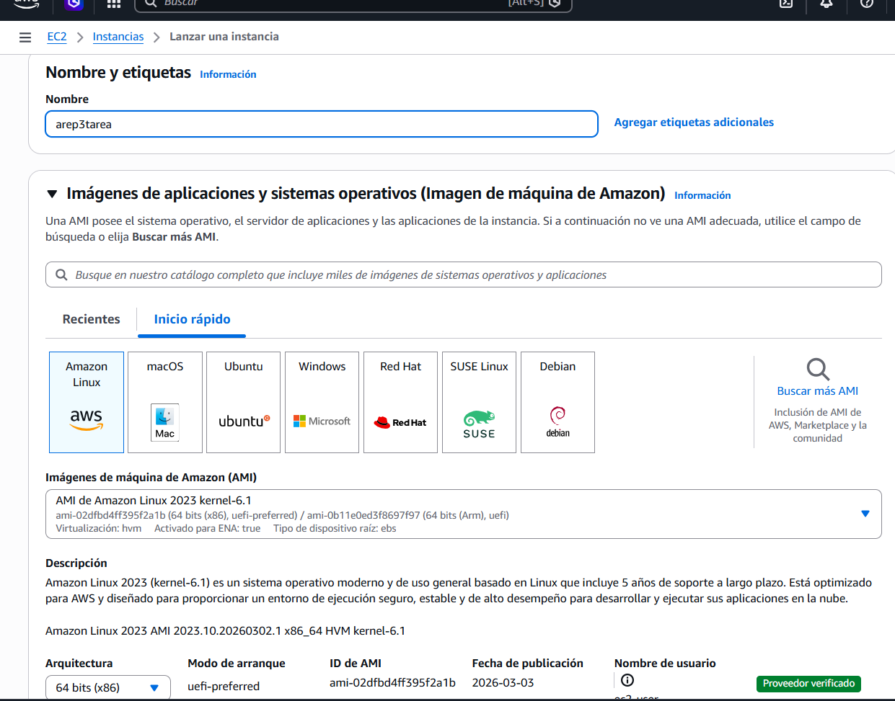
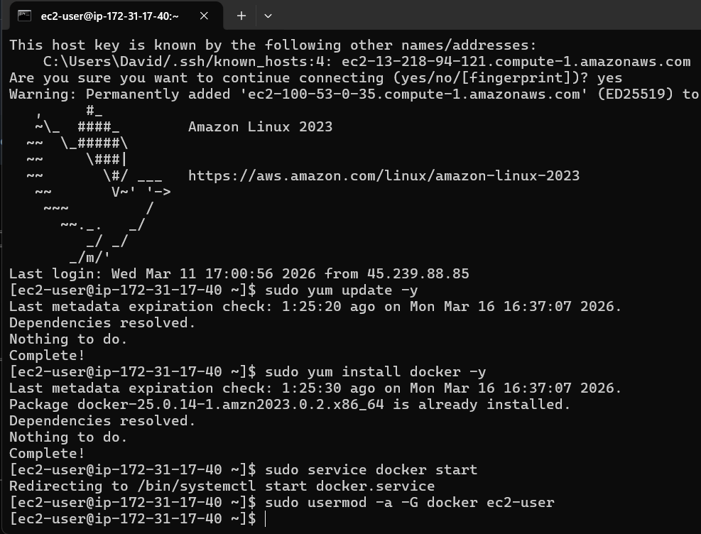
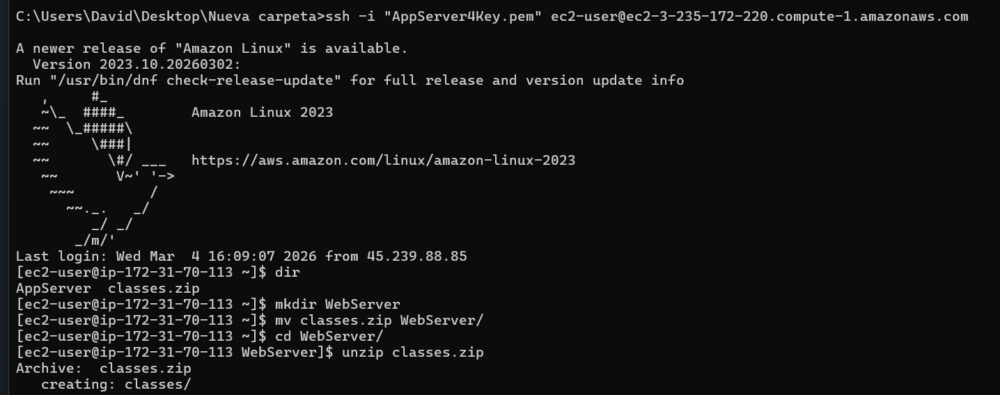
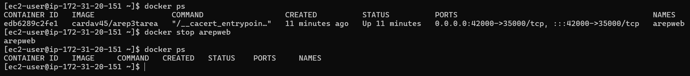
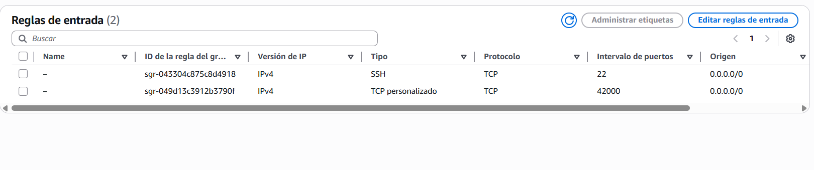
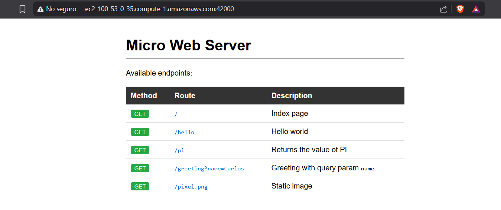

# Servidor Web con Framework IoC basado en Reflexión con Docker

- **Autor**: Carlos David Barrero Velasquez
- **Universidad**: Escuela Colombiana de Ingeniería Julio Garavito
- **Asignatura**: Arquitecturas Empresariales (AREP)
- **Fecha**: Marzo 2026

## Introducción

Este laboratorio implementa un **servidor web tipo Apache** en Java puro, sin frameworks externos, que integra un sistema de **Inversión de Control (IoC)** mediante reflexión para construir aplicaciones web a partir de POJOs anotados. El servidor soporta contenido estático (HTML, PNG) y endpoints dinámicos configurados mediante anotaciones personalizadas. Se añade soporte de **concurrencia**, **apagado elegante** y **despliegue con Docker en AWS EC2**.

**Contenido principal**:
- **Servidor HTTP Nativo**: Implementación con `HttpServer` de Java con pool de hilos para concurrencia
- **Framework IoC con Reflexión**: Carga automática de componentes mediante escaneo de classpath y anotaciones
- **Anotaciones Personalizadas**: `@RestController`, `@GetMapping`, `@RequestParam` para definir servicios REST
- **Contenerización con Docker**: Imagen publicada en Docker Hub y desplegada en AWS EC2

---

## Estructura del Repositorio

```
web/
│
├── src/
│   ├── main/
│   │   ├── java/com/eci/arep/web/
│   │   │   ├── WebApplication.java          # Bootstrap del framework
│   │   │   ├── ControllerRegistry.java      # Registro y escaneo de controladores
│   │   │   ├── HttpWebServer.java           # Servidor HTTP concurrente
│   │   │   ├── RouteHandler.java            # Invocador de métodos por reflexión
│   │   │   ├── Request.java                 # Parseador de query params
│   │   │   ├── GetMapping.java              # Anotación para endpoints GET
│   │   │   ├── RestController.java          # Anotación de componente
│   │   │   ├── RequestParam.java            # Anotación de parámetros
│   │   │   └── HelloController.java         # Controlador de ejemplo
│   │   └── resources/
│   │       └── static/
│   │           ├── index.html               # Página principal con índice de endpoints
│   │           └── pixel.png                # Imagen de prueba
│   └── test/
│       └── java/com/eci/arep/web/
│           └── WebApplicationTests.java     # Pruebas unitarias
├── Dockerfile                                # Imagen Docker del servidor
├── pom.xml                                   # Configuración Maven
└── README.md                                 # Este archivo
```

---

## Cómo Ejecutar Localmente

### Requisitos:
- Java 17+
- Maven 3.9+

### Compilar y correr:

```bash
mvn package
java -cp "target/classes;target/dependency/*" com.eci.arep.web.WebApplication
```

### Endpoints disponibles:

```
http://localhost:35000/
http://localhost:35000/hello
http://localhost:35000/pi
http://localhost:35000/greeting?name=Carlos
http://localhost:35000/pixel.png
```

---

## Despliegue con Docker

### 1. Compilar el proyecto

```bash
mvn package
```

### 2. Construir la imagen Docker

```bash
docker build --tag dockersparkprimer .
```

<p align="center">
  
</p>

### 3. Correr el contenedor

```bash
docker run -d -p 8080:35000 dockersparkprimer
```

El servidor queda disponible en `http://localhost:8080`. El puerto `35000` interno del contenedor se mapea al `8080` del host.

<p align="center">
  
</p>

<p align="center">
  
</p>

---

## Publicación en Docker Hub

### 1. Etiquetar y subir la imagen

```bash
docker tag dockersparkprimer cardav45/arep3tarea
docker login
docker push cardav45/arep3tarea
```

<p align="center">
  
</p>

<p align="center">
  
</p>

La imagen queda disponible públicamente en: `docker.io/cardav45/arep3tarea`

### 2. Correrla desde cualquier máquina

```bash
docker pull cardav45/arep3tarea
docker run -d -p 8080:35000 cardav45/arep3tarea
```

---

## Despliegue en AWS EC2

### 1. Lanzar instancia EC2

Se crea una instancia EC2 con Amazon Linux 2023.

<p align="center">
  
</p>

### 2. Instalar Docker en la instancia

```bash
sudo yum update -y
sudo yum install docker -y
sudo service docker start
sudo usermod -a -G docker ec2-user
```

<p align="center">
  
</p>

Cerrar sesión y volver a ingresar por SSH para que los cambios de grupo apliquen.

### 3. Conectarse por SSH

```bash
ssh -i "AppServer4Key.pem" ec2-user@ec2-100-53-0-35.compute-1.amazonaws.com
```

<p align="center">
  
</p>

### 4. Ejecutar la imagen desde Docker Hub

```bash
docker run -d --name arepweb -p 42000:35000 cardav45/arep3tarea
```

Para detener el contenedor:

```bash
docker stop arepweb
```

<p align="center">
  
</p>

### 5. Configurar Security Group (Inbound Rules)

Agregar una regla de entrada en la consola de AWS:

```
Type:     Custom TCP
Port:     42000
Source:   0.0.0.0/0
```

<p align="center">
  
</p>

### 6. Verificar acceso público

```
http://ec2-100-53-0-35.compute-1.amazonaws.com:42000/
http://ec2-100-53-0-35.compute-1.amazonaws.com:42000/hello
http://ec2-100-53-0-35.compute-1.amazonaws.com:42000/pi
http://ec2-100-53-0-35.compute-1.amazonaws.com:42000/greeting?name=Carlos
```

<p align="center">
  
</p>

---

## Mejoras al Framework

### Concurrencia

Por defecto `HttpServer` usa un solo hilo. Se reemplazó por un pool fijo de 10 hilos, permitiendo que el servidor atienda varias peticiones al mismo tiempo sin que una bloquee a las demás:

```java
server.setExecutor(Executors.newFixedThreadPool(10));
```

### Apagado controlado

Cuando el proceso recibe una señal de terminación (`Ctrl+C` o `docker stop`), un shutdown hook intercepta la señal y le da hasta 5 segundos al servidor para terminar las conexiones que tenga activas antes de cerrarse:

```java
Runtime.getRuntime().addShutdownHook(new Thread(() -> {
    System.out.println("Shutting down server...");
    server.stop(5);
    System.out.println("Server stopped.");
}));
```

---

## Pruebas Automatizadas

Se implementaron pruebas unitarias que validan:
- Registro de rutas con `@GetMapping`
- Resolución de `@RequestParam` con valor por defecto
- Resolución de `@RequestParam` desde query string

```bash
mvn test
```

Resultado:
```
Tests run: 3, Failures: 0, Errors: 0, Skipped: 0
BUILD SUCCESS
```

---

## Arquitectura del Framework IoC

### Flujo de Ejecución

```
1. WebApplication.main()
   └─> ControllerRegistry.scanPackage("com.eci.arep")

2. Escaneo de componentes
   ├─> Buscar clases con @RestController
   ├─> Instanciar controladores
   └─> Registrar métodos @GetMapping en mapa de rutas

3. HttpWebServer.start() en puerto 35000
   └─> Pool de 10 hilos para concurrencia

4. Atención de solicitudes
   ├─> GET /greeting?name=Carlos
   ├─> RouteHandler encuentra método anotado
   ├─> Resuelve @RequestParam("name")
   └─> Invoca método por reflexión → "Hola Carlos"
```

---

## Demo en Video

> **Nota:** El video requiere cuenta institucional de la Escuela Colombiana de Ingeniería Julio Garavito para ser visualizado.

[Ver demo del funcionamiento](https://pruebacorreoescuelaingeduco-my.sharepoint.com/:v:/g/personal/carlos_barrero-v_mail_escuelaing_edu_co/IQD_RU1lDeeoRZIxUoeb6fAJAVrtj-0bkbDLdpTgk0pTgDU?nav=eyJyZWZlcnJhbEluZm8iOnsicmVmZXJyYWxBcHAiOiJPbmVEcml2ZUZvckJ1c2luZXNzIiwicmVmZXJyYWxBcHBQbGF0Zm9ybSI6IldlYiIsInJlZmVycmFsTW9kZSI6InZpZXciLCJyZWZlcnJhbFZpZXciOiJNeUZpbGVzTGlua0NvcHkifX0&e=FwEUQP)

---

## Referencias

- Oracle Java Documentation: [Reflection API](https://docs.oracle.com/javase/tutorial/reflect/index.html)
- Oracle Java Documentation: [HTTP Server](https://docs.oracle.com/en/java/javase/17/docs/api/jdk.httpserver/com/sun/net/httpserver/HttpServer.html)
- AWS Documentation: [Amazon EC2 User Guide](https://docs.aws.amazon.com/ec2/)
- Docker Documentation: [Docker Hub](https://hub.docker.com/)
